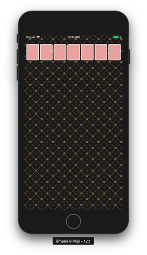
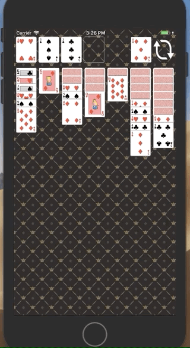

# 카드게임 앱

1. <a href="#1-카드게임판-시작하기">카드게임판 시작하기</a>
2. <a href="#2-카드-UI">카드 UI</a>
3. <a href="#3-카드스택-화면-표시">카드스택 화면 표시</a>
4. <a href="#4-제스처-인식과-게임-동작">제스처 인식과 게임 동작</a>

<br>

## 1. 카드게임판 시작하기

### 요구사항

- StatusBar 스타일 변경
- ViewController 루트 뷰 배경이미지 지정
- 화면에서 카드가 적정 위치에 균등하게 보이도록 ViewController 에서 이미지 뷰 추가

<br>

### 구현방법

#### 1. StatusBar 스타일 변경

처음에는 `AppDelegate` 에서 `UIApplication.shared` 의 `setStatusBarStyle()` 메소드로 스타일을 변경하려고했습니다. [공식문서](https://developer.apple.com/documentation/uikit/uiapplication/1622923-setstatusbarstyle)를 찾아보니 이 방법은 Deprecated되었으며, iOS 7 이후 부터는 status bar를 뷰 컨트롤러가 관리한다고 명시되어있었습니다. 

따라서, `ViewController` 클래스에서 **preferredStatusBarStyle** 프로퍼티를 오버라이드하여 **UIStatusBarStyle.lightContent**로 지정했습니다.

<br>

#### 2. ViewController 루트 뷰 배경이미지 지정

Assets.xcassets에 저장한 파일로 UIImage를 생성한 후, 이 이미지를 패턴으로 하는 [UIColor](https://developer.apple.com/documentation/uikit/uicolor/1621933-init)를 뷰 컨트롤러 루트 뷰의 `backgroundColor` 로 지정했습니다.

```swift
private func setBackground() {
    guard let image = UIImage(named: "bg_pattern.png") else { return }
    self.view.backgroundColor = UIColor(patternImage: image)
}
```

<br>

#### 3. ViewController에서 화면에 균일하게 카드 이미지 뷰 추가

`UIImageView` 를 상속받는 `CardImageView` 커스텀 뷰를 생성하여, 이미지 뷰 왼쪽 위 좌표**(origin: CGPoint)**와 가로 길이**(width: CGFloat)**로 생성초기화하는 convenience init 메소드를 구현했습니다.

뷰 컨트롤러 내부에는 `CardImageViewCreater` 라는 구조체를 추가하여, 뷰 컨트롤러 루트 뷰의 **frame.width** 값을 바탕으로 `CardImageView` 의 좌표와 가로 길이를 계산하여 생성해주도록 구현했습니다. 이렇게 생성된 이미지 뷰는 루트 뷰의 서브 뷰로 추가되어 화면에 균등한 크기와 여백으로 나타나게됩니다.

```swift
class ViewController: UIViewController {
    ...
	private func addCardImageViews() {
        let cardCreater = CardImageViewCreater(numberOfCards: 7, sideMargin: 5, topMargin: 40)
        let cards = cardCreater.createHorizontally(within: self.view.frame.width)
        cards.forEach { self.view.addSubview($0) }
    }
    ...
}
```

<br>

### 실행화면

> 완성일자: 2019.01.23 18:32




<br>

## 2. 카드 UI

### 요구사항

- 레벨 2 CardGame 미션 프로젝트 코드 가져와서 사용
- Card 객체 개선
  - 해당 카드 이미지 매치
  - 앞뒷면 처리
- CardDeck 인스턴스 생성 후, 뽑은 카드를 바탕으로 주어진 화면과 동일하게 뷰 추가
- Shake 모션 이벤트 발생 시, 카드를 새롭게 뽑아 뷰에 반영

<br>

### 구현방법

#### 1. Card 클래스 객체 개선

지난 [카드게임 프로젝트](https://github.com/popsmile/swift-cardgame/tree/popsmile)에서 Main, Input/OutputView와 관련된 파일을 제외한 나머지 코드를 그대로 가져와 추가했습니다. 카드에 활용할 이미지파일도 프로젝트에 추가해주었습니다.

`Card` 클래스에 앞면인지, 뒷면인지 판단할 수 있는 프로퍼티 `isBack`과 뒤집는 메소드 `flip()`을 추가했습니다. 그리고 해당 카드와 매치되는 이미지 파일명을 프로퍼티로 추가했습니다. 만약 뒤집혀있다면 `nil` 을 리턴하도록 구현했습니다.

```swift
class Card {
	...
    private var isBack: Bool = true

    ...
    var imageName: String? {
        guard isBack else { return nil }
        guard let suit = self.suit.firstLetter else { return nil }
        return "\(suit)\(rank.value)"
    }
    
    func flip() {
        isBack.toggle()
    }
}
```

<br>

#### 2. CardDeck 에서 뽑은 카드로 화면에 뷰 추가

기존의 `CardImageView` 외에 빈 공간을 나타내는 `CardSpaceView` 클래스를 추가했습니다. 두 뷰를 모두 다루기위해 뷰 컨트롤러 내의 `CardImageViewCreater` 구조체를  `CardViewCreater` 로 이름을 바꿔주었습니다. 그리고 `Align` 열거형을 추가하여 왼쪽, 오른쪽 정렬을 지원하도록 추가 구현했습니다.

<br>

#### 3. Shake 모션 이벤트 발생 시, 카드를 새롭게 뽑아 뷰에 반영

Shake 모션 이벤트가 발생하여  뷰 컨트롤러의 `motionEnded()` 메소드가 호출되면, 기존 카드 이미지 뷰를 삭제하고 초기화한 `cardDeck` 에서 새롭게 뽑은 카드 뷰를 추가해주도록 구현했습니다.

```swift
override func motionEnded(_ motion: UIEvent.EventSubtype, with event: UIEvent?) {
    super.motionEnded(motion, with: event)
    if motion == .motionShake {
        cardImageViews.forEach { $0.removeFromSuperview() }
        cardDeck.reset()
        addCardImageViews()
    }
}
```

<br>

### 실행화면

> 완성일자: 2019.01.25 14:35


<br>

### 수정내용

- `CardViewLayout` 구조체를 추가로 생성하여, 뷰 컨트롤러 내부에 선언되어있던 프로퍼티를 분리해서 구조화했습니다.

- 위 구현방법 3번의 뷰를 삭제하고 새로 추가하는 방식을 기존 뷰를 재사용해 이미지만 변경하는 방식으로 수정했습니다.

  ```swift
  override func motionEnded(_ motion: UIEvent.EventSubtype, with event: UIEvent?) {
      super.motionEnded(motion, with: event)
      if motion == .motionShake {
          cardDeck.reset()
          replaceImagesOfCardImageViews()
      }
  }
  ```

- 뷰 컨트롤러 내부에 nested 되어있던 `CardViewCreater` 구조체를 `CardViewFactory` 로 이름을 변경하고 별도의 객체로 분리하였습니다.

<br>

## 3. 카드스택 화면 표시

### 요구사항

- `CardDeck` 객체를 활용해 주어진 화면처럼 카드스택 형태의 뷰 구현하기
  - 카드스택을 관리하는 모델 객체 설계
  - 각 스택 맨 위 카드만 앞면으로 뒤집기
- 카드스택에 표시한 카드를 제외한 나머지 카드를 우측 상단에 모두 뒤집어 쌓아놓기
- 우측 상단 카드를 터치하면 카드를 뒤집어 좌측에 표시하기
- 남은 카드가 없을 시, 리프레시 이미지 표시하기
- Shake 이벤트 발생 시, `CardDeck` 을 초기화하고 처음 상태로 되돌리기

### 구현방법

#### 1. 카드스택 형태의 뷰 구현하기

`CardStackView` 클래스를 추가해 서브 뷰로 `CardView` 를 갖도록 구현했습니다. `CardViewFactory` 객체에서 가로 방향으로 카드 뷰를 추가하는 과정을 카드 스택 뷰를 추가하도록 수정했습니다. 

<br>

#### 2. 카드 덱의 나머지 카드 우측 상단에 모두 쌓아놓기 / 터치 시, 카드 뒤집어 좌측에 표시

`CardStackView` 를 상속받는 `CardDeckView` 클래스를 추가했고, 우측 상단에 해당 뷰를 추가하여 카드 덱의 나머지 카드 이미지 뷰를 쌓아놓았습니다.

위 카드 덱 뷰의 좌측에 `CardDeckView` 를 하나 더 추가하여 cardDeckOpenedView라고 이름지었습니다. 위의 카드 덱 뷰를 터치 시에 좌측 덱 뷰로 뒤집혀 이동하도록 구현했습니다.

#### + 남은 카드가 없을 시, 리프레시 이미지 표시하기

그리고 카드 덱 뷰에 더 이상 터치할 카드 뷰가 남지 않았을 경우, 리프레시 이미지를 표시해주기 위한 메소드 `popWithRefreshImage()` 를 사용했습니다.

```swift
override func touchesBegan(_ touches: Set<UITouch>, with event: UIEvent?) {
    super.touchesBegan(touches, with: event)
    guard let touch = touches.first else { return }
    if touch.view == cardDeckView {
        guard let cardView = cardDeckView.popWithRefreshImage() else { return }
        cardView.flip()
        cardDeckOpenedView.push(cardView)
    }
}
```

<br>

#### 3. Shake 이벤트 발생 시,  모두 초기 상태로 되돌리기

전 단계에서 `resetCardDeckView()` 메소드를 추가해, 위 2번에서 터치 시에 우측 카드 덱 뷰에서 좌측 카드 덱 뷰로 이동한 모든 카드 뷰를 다시 원상복귀시켰습니다.

```swift
override func motionEnded(_ motion: UIEvent.EventSubtype, with event: UIEvent?) {
    super.motionEnded(motion, with: event)
    if motion == .motionShake {
        cardDeck.reset()
        resetCardDeckView() // 전 단계 이후에 추가된 메소드
        replaceImagesOfCardViews()
    }
}
```

<br>

 #### + ViewModel 클래스 추가

`CardView` , `CardStackView` , `CardStacksView` 에 1:1로 대응하는 뷰 모델 클래스 `CardViewModel` , `CardStackViewModel` , `CardStacksViewModel` 을 구현했습니다. 아래는 그 중 **CardViewModel** 예시이고, 이 클래스가 **CardView** 에 어떤 방식으로 쓰였는지 나와있습니다.

```swift
protocol CardViewModelDelegate {
    init(card: Card)
    var imageName: String? { get }
    var imageDidChange: ((CardViewModelDelegate) -> ())? { get set }
    func flip()
}

class CardViewModel: CardViewModelDelegate {
    private var card: Card

    required init(card: Card) {
        self.card = card
    }

    var imageName: String? {
        didSet {
            imageDidChange?(self)
        }
    }

    var imageDidChange: ((CardViewModelDelegate) -> ())?

    func flip() {
        card.flip()
        imageName = card.imageName
    }

}
```

`CardView` 는 프로퍼티로 `CardViewModelDelegate` 를 갖고있고, 이 뷰 모델의 클로저 프로퍼티를 카드 뷰 내부에서 지정해줍니다. 따라서 카드 뷰가 **flip()** 되면, 뷰 모델에서 해당 카드를 플립하고 뷰 모델의 **이미지 이름을 갱신**합니다. 뷰 모델의 이미지 이름은 **didSet** 될 때마다, **imageDidChage** 클로저를 실행하고 이 클로저는 카드 뷰 안에서 이미지를 갱신해줍니다.

```swift
class CardView: UIImageView {

    var viewModel: CardViewModelDelegate! {
        didSet {
            viewModel.imageDidChange = { [unowned self] viewModel in
                self.setImage(named: viewModel.imageName)
            }
        }
    }
    ...

    func flip() {
        viewModel.flip()
    }
}
```

<br>

### 실행화면

> 완성일자: 2019.01.29 22:35
>
> 추가수정 완료일자: 2019.02.01 00:32

카드 덱 터치 시, 카드 한 장을 뒤집어 좌측에 표시하고 있습니다. 모든 카드를 뒤집어 소진되었을 시 리프레시 이미지가 표시되고, Shake 모션을 취하면 초기 상태로 되돌립니다.


<br>

### 수정내용

CardView와 CardViewModel 관계를 중심으로 대폭 수정헀습니다.

#### 1. 뷰 계층

뷰는 아래와 같은 포함관계를 갖도록 수정했습니다. 뷰 모델과 모델 또한 동일한 포함관계를 갖도록 구현했습니다.

- ViewController
  - CardGameView
    - CardSpacesView
      - [CardSpaceView]
    - CardPileView
      - [CardView]
    - CardDeckView
      - [CardView]
    - CardStacksView
      - [CardStackView]
        - [CardView]

#### 2. NotificationCenter 활용

`CardDeckView` 에 터치 이벤트가 발생할 경우, `CardDeckViewModel` 내부의 `CardViewModel` 배열 중 마지막 요소가 `flip` 됩니다. `CardViewModel` 에서 관리하는 `opened` 프로퍼티가 변경되는 경우 `.cardDidFlip` 노티피케이션이 포스트되고, 이 뷰 모델을 소유한 `CardView` 에서 노티피케이션을 받아 뷰를 다시 그리도록 구현했습니다.

ShakeMotion이 발생하여 카드게임 판을 초기화시킬 경우에도 이와 같은 방식으로 구현했습니다.

<br>

## 4. 제스처 인식과 게임 동작

### 요구사항

- [solitaire-klondike](https://www.solitaire-klondike.com/klondike.html) 게임과 동일한 동작
  - 카드 이미지 앞면이 보이는 카드만 더블 탭이 가능하도록
  - 카드 더블 탭 시, 아래 규칙을 바탕으로 이동하도록
    - 좌측 상단에 **같은 모양의 Suit, 한 단계 낮은Rank**를 가진 카드가 있을 때 이동 (A부터 2, 3, ... K 까지 쌓는다.)
    - 카드 스택 중에 **다른 색의 Suit와 한 단계 높은 Rank**를 가진 카드가 스택 중에 가장 마지막에 위치해 있을 때 이동 (K부터 Q, J, ... A 까지 쌓는다.)
  - 카드 덱의 카드를 모두 오픈했을 경우, 리프레시 이미지 클릭 시 다시 덱으로 쌓이도록
  - Shake 이벤트 발생 시 카드게임을 초기 상태로

<br>

### 구현방법

#### 1. 두 개의 카드 객체를 비교할 수 있는 메소드 구현

`Card` 클래스에 비교 메소드를 추가하고, 이를 활용해서 `CardViewModel` 를 비교할 수 있도록 구현했습니다.

```swift
class CardViewModel {
    ...
	var isLowest: Bool
    var isHighest: Bool

    func hasSameSuit(with cardViewModel: CardViewModel) -> Bool
    func hasSameColor(with cardViewModel: CardViewModel) -> Bool
    func isNextHigher(than cardViewModel: CardViewModel) -> Bool
    func isNextLower(than cardViewModel: CardViewModel) -> Bool
    ...
}
```

<br>

#### 2. 커스텀 UIGestureRecognizer 생성

더블 탭만을 인식하는 클래스를 만들어주기 위해, `UITapGestureRecognizer` 를 상속받는 커스텀 클래스를 생성해주었습니다.

```swift
class DoubleTapGestureRecognizer: UITapGestureRecognizer {

    override init(target: Any?, action: Selector?) {
        super.init(target: target, action: action)
        numberOfTapsRequired = 2
    }

}

```

<br>

#### 3. 뷰마다 필요한 GesutreRecognizer 추가

`CardStackView` 하위 뷰로 `CardView` 를 추가할 때, `DoubleTapGestureRecognizer` 를 만들어 할당해줍니다. 더블 탭 제스처가 일어났을 경우, 해당 스택 뷰에서 위치정보를 담아 노티피케이션을 포스트합니다. 위치정보는 `IndexPath` 를 활용해보았습니다. 그 이유는 카드 위치를 알기 위해 카드 인덱스를 포함하여 카드스택의 인덱스 또한 알아야하기 때문입니다.

```swift
class CardStackView: UIView {
    ...
    private func addDoubleTapGestureRecognizer(to cardView: CardView) {
        let doubleTapGestureRecognizer = DoubleTapGestureRecognizer(target: self, action: #selector(handleDoubleTapGesture(sender:)))
        cardView.addGestureRecognizer(doubleTapGestureRecognizer)
    }
    
    @objc private func handleDoubleTapGesture(sender: DoubleTapGestureRecognizer) {
        guard let cardStacksView = superview as? UIStackView else { return }
        guard let indexOfCardStack = cardStacksView.arrangedSubviews.firstIndex(of: self) else { return }
        
        guard let cardView = sender.view else { return }
        guard let indexOfCard = subviews.firstIndex(of: cardView) else { return }
        
        let indexPath = IndexPath(item: indexOfCard, section: indexOfCardStack)
        let userInfo = [Notification.InfoKey.indexPathOfCard: indexPath]
        NotificationCenter.default.post(name: .cardDidDoubleTapped, 
                                        object: self, userInfo: userInfo)
    }
    ...
}
```

`CardView` 가 `CardDeckView` 의 하위 뷰로 추가될 경우 `UITapGestureRecognizer` 를 할당해주었고, 이전 스텝과 동일하게 `CardPileView` 로 이동하면서 카드가 뒤집힙니다.

또한, GesutreRecognizer가 할당되었던 `CardView` 가 상위 뷰에서 빠지거나 다른 뷰의 하위 뷰로 추가될 경우, 이전 GesutreRecognizer를 삭제하고 새롭게 할당해주었습니다.

<br>

#### 4. 카드 더블 탭 시 뷰 컨트롤러가 동작 개시

더블 탭 시 뷰에서 포스트하는 `.cardDidDoubleTapped` `.cardPileDidDoubleTapped` 노티피케이션을 뷰 컨트롤러가 관찰하고 있습니다. 

아래 `handleDoubleTapOfCardStacks(_:)` 메소드는 노티피케이션에 담긴 `userInfo` 에서 indexPath를 가져와 `cardGameViewModel` 에 이동가능한 위치가 있는지 확인합니다. 이동가능한 위치가 있다면, `CardGameView` 에 이 정보를 전달해 뷰를 이동시킵니다. 이동하고자하는 위치는 카드스택보다 좌측 상단의 스페이스 공간을 우선적으로 확인합니다.

```swift
class ViewController: UIViewController {
	...
    private func registerAsObserver() {
        ...
        NotificationCenter.default
        .addObserver(self, selector: #selector(handleDoubleTapOfCardStacks(_:)),
                     name: .cardDidDoubleTapped, object: nil)
        NotificationCenter.default
        .addObserver(self, selector: #selector(handleDoubleTapOfCardPile),
                     name: .cardPileDidDoubleTapped, object: nil)
        ...
    }

    @objc private func handleDoubleTapOfCardStacks(_ notification: Notification) {
        guard let indexPath = notification
            .userInfo?[Notification.InfoKey.indexPathOfCard] as? IndexPath else { return }
            
        if let space = cardGameViewModel.moveCardFromStackToSpace(cardAt: indexPath) {
            cardGameView.moveCardFromStackToSpace(indexPathOfCard: indexPath, to: space)
        }
        if let stack = cardGameViewModel.moveCardFromStackToStack(cardAt: indexPath) {
            cardGameView.moveCardFromStackToStack(indexPathOfCard: indexPath, to: stack)
        }
    }
	...
}
```

<br>

#### 5. ShakeMotion 발생 시 카드게임 초기화

ShakeMotion이 발생하면 뷰 컨트롤러가 기존 `CardGameView` 를 하위뷰에서 제거하고,  `CardGameView` 와 `CardGameViewModel` 를 새롭게 만들어 화면과 카드게임을 모두 초기상태로 만듭니다.

> 아쉬운 점
>
> 기존의 뷰와 뷰 모델을 삭제하고 재생성하는 방법보다 재사용하는 방법을 활용하고자 두-세가지 방법으로 시도해보았습니다. 하지만, 매칭된 뷰와 뷰 모델 중 일부가 동일한 위치로 이동하지 않아 자꾸 어긋나게 동작하여 결국 방향을 바꾸었습니다...😥

<br>

### 실행화면

> 완성일자: 2019.02.19 15:09
>
> 시뮬레이터는 iPhone 8 Plus 입니다.

[solitaire-klondike](https://www.solitaire-klondike.com/klondike.html) 게임 규칙을 바탕으로 동작되고 있습니다.


Shake 모션 발생 시, 카드게임이 리셋됩니다.

